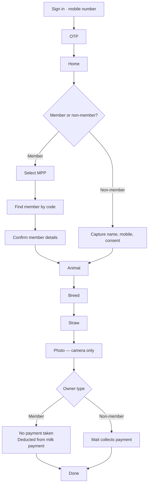

# Mait app — design brief

A working brief for whoever designs a screen of the Mait Android app, human or agent. It is the
whole of the visual and interaction language in one place: read it once, then design one screen
at a time against it.

The app is being designed fresh. **Do not take the existing `mobile/` screens as precedent** —
they are being replaced. The reference is the admin portal, which is built and shipping: same
palette, same faces, same shapes, same words for the same things. A completed AI event is the
same green on a Mait's handset and on the admin's dashboard, because the two are one product.

> **Source of truth for tokens:** [`admin-web/assets/css/tokens.css`](../admin-web/assets/css/tokens.css)
> and its mirror [`mobile/src/theme/tokens.ts`](../mobile/src/theme/tokens.ts). The colour and
> typography tables further down in [`DESIGN_SYSTEM.md`](DESIGN_SYSTEM.md) are **stale** — they
> name Lexend and a blue `#43637E` palette that the tokens superseded. Where the two disagree,
> the tokens win. Everything in this brief is taken from the tokens.

---

## 1 · Who you are designing for

Not a persona exercise. These five facts decide most arguments:

| | Consequence for the design |
| --- | --- |
| A **Mait** is a village AI technician, often semi-literate | Words are a last resort. Shape, colour and position carry meaning first. |
| They work **outdoors, in sunlight, one-handed**, often with a wet or gloved hand | High contrast, large targets, controls in the bottom third, no precision gestures. |
| The phone is a **₹8,000 Android**, small and slow | No heavy motion, no blur, no long lists rendered at once. Design for 360×640dp. |
| **The network is not there.** Villages have no usable data | Offline is the default state, not an error. See §8. |
| They read **Hindi or English**, and switch | Every string is translated. Devanagari runs taller and longer — never fix a height to English. |

**The one-sentence test for any screen:** could a Mait standing in a field, holding a phone in
one hand and an animal's rope in the other, answer this screen's question in under five seconds
without reading a paragraph? If not, redesign it.

---

## 2 · Non-negotiables

These override taste. If a design looks better breaking one of these, the design is wrong.

1. **One question per screen.** A screen asks one thing and offers one way forward.
2. **One primary action, always in the same place** — full-width, bottom, green.
3. **Touch targets ≥ 48×48dp.** No exceptions, including icon-only buttons.
4. **Body text never below 15px.**
5. **Colour never carries meaning alone.** Every status has a word and a shape as well.
6. **Never a bare input in the capture flow.** Values live in cards with a label above.
7. **Label above the field, always.** Placeholder-as-label disappears exactly when a hesitant
   user needs it.
8. **Camera-first for proof.** No gallery picker anywhere in the capture flow.
9. **Nothing is square.** Radius 10–18px on everything.
10. **A blocked thing is shown, not hidden** — with the reason in place of its subtitle. A Mait
    who cannot find a record assumes the app is broken; one who sees it greyed with "No mobile
    number" knows what to do.

---

## 3 · Colour

The palette is three scales and a set of roles. **Design with the roles.** Reach into a scale
only when a role does not exist for what you need, and say which step you used.

### Roles

| Role | Value | Where it goes |
| --- | --- | --- |
| `primary` | `#3BB77E` Nest Green 500 | The one screen-owning action. Filled buttons, selected states, progress fill. |
| `primary-pressed` | `#329C6B` | Pressed state of the above. |
| `primary-dark` | `#287D56` | Green **text** and green icons on a pale surface. Never a fill. |
| `primary-wash` | `#EAF7F1` | The tint behind a chosen row, a success notice, a green card. |
| `secondary` | `#FDC040` Cream Yolk 500 | Attention, waiting, pending. Fill or border only. |
| `secondary-pressed` | `#E0A52F` | Yellow icons and glyphs. |
| `secondary-wash` | `#FFF8E9` | The tint behind a "something to do" notice. |
| `ink` | `#253D4E` | All primary text. Every dark surface. The hero. |
| `error` | `#E54D42` | Blocked, failed, destructive. |
| `error-wash` | `#FDECEA` | The tint behind a red notice or a blocked row. |
| `info` | `#3E92E5` | Neutral information, sync state, "something to know". |
| `info-wash` | `#D8E7FA` | The tint behind a blue notice. |
| `text` | `#253D4E` | Default copy. |
| `text-muted` | `#7A8893` | Subtitles, captions, helper lines. |
| `text-disabled` | `#8897A3` | Unavailable text. |
| `border` | `#E3E7E9` | Every hairline. |
| `surface` | `#FFFFFF` | Cards, sheets, inputs. |
| `background` | `#F4F5F3` | The page behind the cards. |

### Using the shades

Each scale runs 50 → 900. They are not decoration; each step has a job. This table is the
answer to "which green?":

| Step | Job | Example |
| --- | --- | --- |
| **50** | Wash — the tint of a whole card or notice | Chosen row fill, success banner |
| **100** | The border of something washed in 50 | Border of a green card |
| **200** | A visible border or divider on a tinted surface | Selected-card outline |
| **300** | Disabled version of the role; secondary chart series | Greyed-out green |
| **400** | Hover/press on a pale surface | Rarely needed on mobile |
| **500** | **The role itself** — the fill everyone recognises | Primary button, progress fill |
| **600** | Pressed state of the fill | Button while held |
| **700** | **Text and icons** of that colour on a light surface | Green label, green glyph |
| **800–900** | Deep surfaces and rare high-contrast text | Ink 800 for a dark sheet |

Two rules that catch most mistakes:

- **Yellow never carries text on a light surface.** `#FDC040` fails contrast against white. Use
  it as a fill, a border or a dot, with ink text on top. For yellow *text*, use Yolk 800.
- **A wash is a surface, never a fill for a small element.** A 50-step green behind a whole card
  reads as a tint; the same green on a 20px chip is invisible.

### Status coding — identical to the portal, no exceptions

| Meaning | Colour | Word on the chip |
| --- | --- | --- |
| Done, verified, accepted | green | `Completed`, `Verified`, `Synced` |
| Waiting, pending, queued | yellow | `Pending`, `Queued`, `Waiting` |
| Blocked, failed, refused | red | `Blocked`, `Failed`, `Not in your stock` |
| Neutral information | blue | `Draft`, `Syncing` |

---

## 4 · Typography

Two faces. No third.

| Use | Face | Weight |
| --- | --- | --- |
| Headings, screen questions, numbers | **Quicksand** | 600–700 |
| Body, labels, buttons, everything else | **Nunito Sans** | 400–600 |

Both are rounded and highly legible — chosen deliberately for a semi-literate user.

| Token | Size / line | Use on mobile |
| --- | --- | --- |
| `display` | 32 / 40 | The one big number on a screen — ₹ amount, straws left |
| `h1` | 24 / 32 | The screen's question, in the hero |
| `h2` | 20 / 28 | Section header |
| `h3` | 17 / 24 | Card title, row title |
| `body` | 15 / 22 | Default copy — **the floor** |
| `label` | 13 / 18 | Field labels, chips |
| `caption` | 12 / 16 | Helper text, timestamps |

Numbers use the heading face — a quantity should read as data, not as prose. Money is always
`₹ 300` with a space, and counts use Indian grouping (`1,05,412`).

---

## 5 · Spacing, radius, elevation

- **4px scale**: 4, 8, 12, 16, 24, 32, 40, 48. Screen gutters are 24 (`space-5`); card padding
  is 16 (`space-4`); the gap between stacked cards is 12 (`space-3`).
- **Radius**: `sm 10` inputs and chips · `md 12` cards · `lg 18` sheets and the hero's bottom
  corners · `pill 999` chips and status pills.
- **Elevation**: resting card `0 1px 3px rgb(37 61 78 / 10%)`. Raised sheet
  `0 18px 40px rgb(37 61 78 / 12%)`. Two levels only — a phone screen has no room for a
  hierarchy of five.

---

## 6 · Screen architecture

Every capture screen is the same three bands. A Mait learns the shape once and it never moves.

```
┌───────────────────────────────┐
│  INK OR GREEN HERO            │  ← who/where am I, and what is being asked
│  ‹  Step 3 of 6               │
│  ▬▬▬▬▬▬▬▬░░░░░░░░             │
│  Whose animal?                │
│  Skipped when you cover one   │
└───────────────────────────────┘
   BODY on background            ← the answer, as cards
   ┌─────────────────────────┐
   │ ◗ KAVITA DEVI      Near │
   │   MEM00000412           │
   └─────────────────────────┘
   ┌─────────────────────────┐
   │ ◗ RADHA SINGH           │
   └─────────────────────────┘

┌───────────────────────────────┐
│      [ Continue  → ]          │  ← one action, always here
└───────────────────────────────┘
```

**1 · Hero.** Full-bleed, rounded bottom corners (`lg`). Contains, in order: a circular
translucent back button with the step label beside it; the progress bar; the question in H1
white; one subtitle line explaining the *consequence*, not the mechanics.

The question is a **question**. *Which MPP? · Whose animal? · How is she paying?* A noun phrase
leaves a Mait guessing what the screen wants.

**2 · Body.** On `background`, 24dp gutters, built only from the components in §7.

**3 · Footer.** One full-width primary CTA, minimum 52dp tall, labelled with the verb and a
forward arrow — `Continue →`, `Save & continue →`, `Submit proof →`. Grey and inert until the
step is genuinely satisfiable. A secondary route out sits **above** it as a green text link,
never as a second button.

---

## 7 · Components

Design these once; reuse them everywhere. Each maps to something already shipping in the portal,
named in brackets so the two products stay one product.

**Selectable row** *(portal: table row + status pill)* — white card, `md` radius, leading rounded
swatch or avatar, title in `h3`, one subtitle line in `caption` muted, optional right-hand pill.
States: *default* white; *chosen* green 200 border with green 50 fill; *blocked* greyed with the
reason replacing the subtitle and a red `Blocked` pill.

**Field card** *(portal: `.field`)* — label above, value below, same card shape as a row. Used
wherever a value is entered or shown in the flow. Never a bare input.

**Info tile** *(portal: `.tile`)* — tinted card, small muted label with a leading glyph on a
white chip, one large number in the heading face, one line of context under it. Tinted by tone:
green for good, yellow for waiting, red for a number someone must act on, grey for neutral.

**Notice** *(portal: `.notice`)* — a full-width banner: leading glyph on a white chip, title in
600, one line of body. Yellow = something to do. Blue = something to know. Red = something
wrong. Green = the all-clear, which matters — a screen whose job is a backlog must be able to
say the backlog is empty.

**Chip / pill** *(portal: `.pill`)* — pill radius, `label` size, 600 weight, wash background with
`-dark`/`-800` text. Always contains a word.

**Primary button** — full width, 52dp, green fill, white 600 text, `md` radius. Disabled is
`disabled-fill` with `text-disabled`, never a faded green.

**Segmented toggle** — for a two-way choice that is not a list: Member / Non-member, Cow /
Buffalo. Full width, pill radius, the selected half filled green with white text.

**Empty state** — never a blank area. A glyph, one sentence of what would be here, and the
action that would put something here.

**Skeleton** — cards keep their shape while loading. The screen must not jump when the answer
lands.

---

## 8 · Offline — the part that matters most

A Mait works where there is no network. **Offline is the normal state, not an error.** Nothing
in the capture flow may block on a request. The design consequences:

**Everything in the flow is captured locally and queued.** The Mait completes the whole
insemination — owner, animal, straw, photo, payment — and walks away. Sync happens later,
invisibly, when a signal appears.

**A persistent, quiet connectivity strip.** Thin, under the hero. Not a modal, not a toast, not
red. Four states:

| State | Look | Words |
| --- | --- | --- |
| Online, nothing waiting | not shown at all | — |
| Offline, working normally | grey/ink strip, cloud-off glyph | `Working offline — saved on this phone` |
| Queued, waiting for signal | yellow strip, count | `3 events waiting to sync` |
| Syncing | blue strip, animated | `Sending 2 of 3…` |
| A row failed | red strip, tappable | `1 event needs your attention` |

**Never say "failed" for a missing network.** A queued event is not an error and must never look
like one — a Mait who thinks their work was lost will redo it, and a duplicate insemination
record is worse than a slow one.

**Every list row carries its own sync state** as a small pill: `Queued` · `Syncing` · `Synced` ·
`Needs attention`. The Mait must be able to answer "did my morning's work go in?" from one
screen.

**What genuinely needs a network** — sign-in OTP, and the payment authorisation OTP for a
non-member. Design an explicit, calm state for each: what the Mait can do now, and what they
must come back for. Never a spinner with no way out.

---

## 9 · The capture flow

This is the flow to design. It differs from the order recorded in
[`SCREEN_INVENTORY.md`](SCREEN_INVENTORY.md) — see §12.



**Sign in.** Mobile number only — no password. Ten digits enables the button. A yellow notice
saying there is no password to remember, because a field user who expects one will look for it.

**Member or non-member.** The first fork, a segmented choice, because everything downstream
depends on it — including who takes the money.

**Member path.** MPP first (skipped automatically when the Mait covers only one — say so in the
subtitle), then the member code, then a confirmation card of the member's details. The
confirmation is not a formality: it is the last point at which a wrong code can be caught, so it
shows name, code, village and mobile, large.

**Non-member path.** Name, mobile, address, and an explicit consent control — not a pre-ticked
box, and not buried.

**Animal, then breed.** Cow/Buffalo as a segmented toggle, then breed as a list. Optional ear
tag.

**Straw.** Scan first, manual entry as the fallback. Two rejections must be visibly different
and separately worded: *not in your stock* and *already used*. They mean different things and
lead to different actions.

**Photo.** Full-bleed camera, no gallery button, GPS and timestamp burned into the frame,
retake allowed. The photo is proof; design it to feel like proof.

### The payment fork — get this right

| | Member | Non-member |
| --- | --- | --- |
| Who pays | The dairy deducts it from her milk payment | The Mait collects, then and there |
| What the Mait does | **Nothing** | Takes cash or UPI, records it |
| What the screen says | A calm green confirmation: *No payment to collect. ₹300 will be deducted from her milk payment.* | *Collect ₹300* with mode, amount, and proof |
| Screens | One confirmation, then Done | Mode → collect → proof/OTP → Done |

For a member this is a **statement, not a step** — a card that informs and moves on. Do not
build a payment screen that a Mait has to dismiss; that teaches them to tap past things.

**Done.** What happened, what it cost, straws remaining, and one obvious way to start the next
one — a Mait doing twelve inseminations a day lives on this screen.

---

## 10 · Language and copy

- Hindi and English, switchable, everything translated. Strings live in `mobile/src/i18n/`, none
  hardcoded.
- **Devanagari runs taller and often longer.** Never fix a button to the height of its English
  label; test every screen in Hindi before calling it done.
- Questions, not nouns, in the hero.
- Subtitles explain the **consequence**, not the mechanics. "She will not be able to sign in" —
  not "mobile_no is null".
- Numbers: Indian grouping. Money: `₹ 300`.
- Never expose a code, a status enum or a field name to a Mait.

---

## 11 · What to hand back for each screen

So that twenty screens designed separately still look like one app:

1. The screen at **360×640dp**, and again at **412×915dp**.
2. Every state it can be in — empty, loading, error, offline, blocked, and the Hindi version.
3. A list of the tokens used, by **role name** (`primary-wash`), never as a hex.
4. Anything new you had to invent, named and specified, so it can go into §7 rather than
   living on one screen.
5. The one-sentence answer to: *what question does this screen ask, and what does the Mait tap
   to answer it?*

---

## 12 · Open questions — resolve before building, not during

These are real conflicts between this brief and what is already built. Flagging them is part of
the job; guessing is not.

1. **A member's event cannot currently complete without a verified payment.** The backend
   refuses to move an AI event to `completed` until a payment is verified
   ([`HANDOVER.md`](HANDOVER.md)). If a member's payment is deducted from her milk rate and the
   Mait takes nothing, that rule needs an owner-type-aware path, or the app will capture member
   events that can never close. **This is the largest open item.**
2. **Flow order.** [`SCREEN_INVENTORY.md`](SCREEN_INVENTORY.md) records MPP → farmer → animal →
   straw → photo → payment. This brief puts the member/non-member fork first. The inventory
   needs updating to match, or this brief does.
3. **Six-step progress.** If the two branches have different lengths, a "Step 3 of 6" label is
   wrong on one of them. Decide whether the indicator is per-branch or the step count is fixed.
4. **`DESIGN_SYSTEM.md` is stale** in its colour and typography tables — it still names Lexend
   and a blue palette. It should be corrected to point at the tokens, so nobody designs from it
   by accident.
