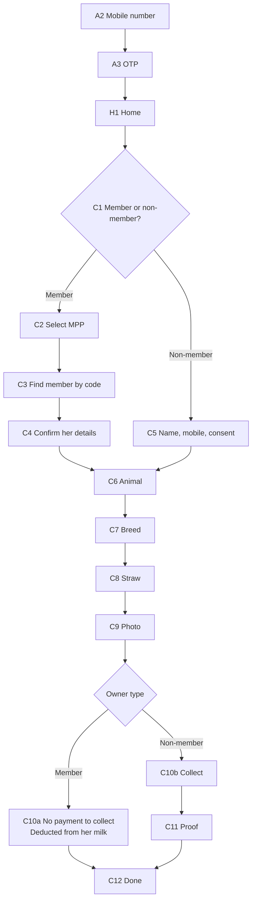

# Mait app — complete design brief

Everything needed to design a screen of the Mait Android app, in one file. Nothing here depends
on reading another document or opening the codebase.

Hand this to a designer — human or agent — with a screen name from §9, and they should be able
to produce something that sits correctly beside every other screen.

> **The app is being designed from scratch.** Ignore whatever exists in `mobile/` today; it is
> being replaced. The reference is the **admin portal**, which is built and shipping. Same
> palette, same faces, same shapes, same words for the same things — a completed AI event is the
> same green on a Mait's handset as on the admin's dashboard, because they are one product.

---

## 1 · The product in a paragraph

Mait AI records cattle artificial insemination for a dairy cooperative in rural Uttar Pradesh. A
**Mait** (also called a Sahayak) is a village AI technician. They travel between villages,
inseminate an animal, and record it on this app: whose animal, which animal, which semen straw,
a photograph as proof, and the money. An admin sees all of it in a web portal. There are ~1,900
Maits, ~3,100 collection points (MPPs) across 19 dairy plants, and ~105,000 members.

Two kinds of owner, and this is the fork the whole app turns on:

- A **member** belongs to the cooperative and sells milk to it. She pays nothing to the Mait —
  the dairy deducts the fee from her milk payment.
- A **non-member** does not. The Mait collects the money then and there.

---

## 2 · Who you are designing for

Not a persona exercise. These facts decide most arguments:

| Fact | Consequence for the design |
| --- | --- |
| A Mait is a village technician, often **semi-literate** | Words are a last resort. Shape, colour and position carry meaning first. |
| They work **outdoors, in sunlight, one-handed**, sometimes with wet or gloved hands | High contrast, large targets, controls in the bottom third, no precision gestures, no long-press-only actions. |
| The phone is a **₹8,000 Android** — small, slow, low-resolution | Design for 360×640dp. No blur, no heavy motion, no shadow stacks. |
| **There is no network.** Villages have no usable data | Offline is the normal state, not an error. See §10. |
| They read **Hindi or English** and switch between them | Everything is translated. Devanagari runs taller and longer — never fix a height to an English label. |
| They do **10–15 inseminations a day**, in a hurry | The flow is muscle memory. Nothing may move between sessions. |

**The five-second test.** Could a Mait standing in a field, phone in one hand and an animal's
rope in the other, answer this screen's question in under five seconds without reading a
paragraph? If not, redesign it.

---

## 3 · Non-negotiables

These override taste. If a design looks better breaking one, the design is wrong.

1. **One question per screen**, one way forward.
2. **One primary action, always in the same place** — full width, bottom, green.
3. **Touch targets ≥ 48×48dp**, including icon-only buttons.
4. **Body text never below 15px.**
5. **Colour never carries meaning alone** — every status has a word as well.
6. **Label above the field, always.** A placeholder-as-label vanishes exactly when a hesitant
   user needs it.
7. **Never a bare input in the capture flow** — values live in cards.
8. **Camera-first for proof.** No gallery picker anywhere in the flow.
9. **Nothing is square.** Radius 10–18dp on everything.
10. **A blocked thing is shown, not hidden**, with the reason in place of its subtitle. A Mait
    who cannot find a record assumes the app is broken; one who sees it greyed with "No mobile
    number" knows what to do.
11. **Nothing in the capture flow blocks on a network request.**
12. **The brand is always `MAIT AI`** in Latin script, in both languages. Never transliterated.

---

## 4 · Colour — the complete palette

Three scales, each 50 → 900. **Design with the roles in §4.2.** Reach into a raw scale only when
no role exists, and say which step you used.

### 4.1 Scales

**Nest Green** — the product's colour. Action, success, "this is fine".

| | 50 | 100 | 200 | 300 | 400 | 500 | 600 | 700 | 800 | 900 |
| --- | --- | --- | --- | --- | --- | --- | --- | --- | --- | --- |
| Hex | `#EAF7F1` | `#CDECDE` | `#9FDCC0` | `#71CCA1` | `#52C08D` | `#3BB77E` | `#329C6B` | `#287D56` | `#1E5E41` | `#143E2B` |

**Cream Yolk** — attention, waiting, pending. Never "good", never "bad".

| | 50 | 100 | 200 | 300 | 400 | 500 | 600 | 700 | 800 | 900 |
| --- | --- | --- | --- | --- | --- | --- | --- | --- | --- | --- |
| Hex | `#FFF8E9` | `#FEEDC4` | `#FEE19E` | `#FED578` | `#FDCB5C` | `#FDC040` | `#E0A52F` | `#B98421` | `#8C6315` | `#5E420C` |

**Ink** — all text, and every dark surface.

| | 50 | 100 | 200 | 300 | 400 | 500 | 600 | 700 | 800 | 900 |
| --- | --- | --- | --- | --- | --- | --- | --- | --- | --- | --- |
| Hex | `#EEF1F3` | `#D4DBE0` | `#AEB9C1` | `#8897A3` | `#5E7180` | `#3D566A` | `#253D4E` | `#1D303D` | `#15232D` | `#0C151B` |

Reds and blues sit outside the scales because they are used only as roles:
`error #E54D42` · `error-pressed #C43A30` · `error-wash #FDECEA` · `info #3E92E5` ·
`info-wash #D8E7FA`.

### 4.2 Roles — use these

| Role | Value | Where it goes |
| --- | --- | --- |
| `primary` | `#3BB77E` green-500 | The one screen-owning action. Filled button, selected state, progress fill |
| `primary-pressed` | `#329C6B` green-600 | Pressed state of that fill |
| `primary-dark` | `#287D56` green-700 | Green **text** and glyphs on a light surface — never a fill |
| `primary-wash` | `#EAF7F1` green-50 | Tint behind a chosen row, a green card, a success notice |
| `secondary` | `#FDC040` yolk-500 | Attention/pending. Fill, border or dot only |
| `secondary-pressed` | `#E0A52F` yolk-600 | Yellow glyphs |
| `secondary-wash` | `#FFF8E9` yolk-50 | Tint behind a "something to do" notice |
| `ink` | `#253D4E` ink-600 | All primary text; every dark surface |
| `success` | `#3BB77E` | Completed AI, payment verified |
| `warning` | `#FDC040` | Pending OTP, low straw count |
| `error` | `#E54D42` | Blocked, failed, destructive |
| `error-wash` | `#FDECEA` | Tint behind a red notice or blocked row |
| `info` | `#3E92E5` | Neutral information, sync state |
| `info-wash` | `#D8E7FA` | Tint behind a blue notice |
| `text` | `#253D4E` | Default copy |
| `text-muted` | `#7A8893` | Subtitles, captions, helper lines |
| `text-disabled` | `#8897A3` ink-300 | Unavailable text |
| `border` | `#E3E7E9` | Every hairline |
| `surface` | `#FFFFFF` | Cards, sheets, inputs |
| `background` | `#F4F5F3` | The page behind the cards |
| `disabled-fill` | `#D4DBE0` ink-100 | A disabled button's fill |

### 4.3 Which step of a scale?

Each step has a job. This table is the answer to "which green?":

| Step | Job | Example |
| --- | --- | --- |
| **50** | Wash — the tint of a whole card, row or notice | Chosen row fill, success banner |
| **100** | The border of something washed in 50 | Border of a green card |
| **200** | A visible border or divider on a tinted surface | Selected-card outline |
| **300** | Disabled version of the role | Greyed green; `text-disabled` |
| **400** | Press feedback on a pale surface | Rare on mobile |
| **500** | **The role itself** — the fill everyone recognises | Primary button, progress fill |
| **600** | Pressed state of that fill | Button while held |
| **700** | **Text and glyphs** of that colour on a light surface | Green label, green tick |
| **800–900** | Deep surfaces; rare high-contrast text on a wash | Ink 800 sheet, Yolk 800 text |

### 4.4 The four rules that catch most mistakes

1. **Yellow never carries text on a light surface.** `#FDC040` fails contrast against white. Use
   it as a fill, border or dot with ink on top. For yellow *text*, use Yolk 800 `#8C6315`.
2. **Green is a fill, not a text colour.** Green text on white is `primary-dark` `#287D56`.
3. **A wash is a surface, never a small fill.** Green-50 behind a card reads as a tint; the same
   green on a 20px chip is invisible.
4. **Where a card carries a wash, its glyph chip goes white** and the glyph carries the colour.
   A chip tinted the same colour as the card behind it disappears into it.

### 4.5 Status coding — identical to the portal, no exceptions

| Meaning | Colour | The word on the chip |
| --- | --- | --- |
| Done, verified, accepted | green | `Completed` · `Verified` · `Synced` |
| Waiting, pending, queued | yellow | `Pending` · `Queued` · `Waiting` |
| Blocked, failed, refused | red | `Blocked` · `Failed` · `Not in your stock` |
| Neutral information | blue | `Draft` · `Syncing` |

---

## 5 · Typography

Two faces. There is no third.

| Use | Face | Weight |
| --- | --- | --- |
| Headings, screen questions, **all numbers** | **Quicksand** | 600–700 |
| Body, labels, buttons, everything else | **Nunito Sans** | 400–600 |

Both are rounded, high-legibility faces — chosen deliberately for a semi-literate user.

| Token | Size / line | Use |
| --- | --- | --- |
| `display` | 32 / 40 | The one big number on a screen — ₹ amount, straws left |
| `h1` | 24 / 32 | The screen's question, in the hero |
| `h2` | 20 / 28 | Section header |
| `h3` | 17 / 24 | Card title, row title |
| `body` | 15 / 22 | Default copy — **the floor** |
| `label` | 13 / 18 | Field labels, chips, buttons |
| `caption` | 12 / 16 | Helper text, timestamps |

Numbers take the heading face wherever they are data rather than prose — a quantity, a code, an
amount. It is what makes a column of figures read as a column. Money is `₹ 300` with a space.
Counts use Indian grouping: `1,05,412`.

---

## 6 · Spacing, radius, elevation, motion

**Spacing — 4dp scale:** 4 · 8 · 12 · 16 · 24 · 32 · 40 · 48.
Screen gutters **24**. Card padding **16**. Gap between stacked cards **12**. Gap between
sections **24**.

**Radius:** `sm 10` chips, glyph tiles · `md 12` cards, inputs, buttons · `lg 18` sheets, hero
bottom corners · `xl 30` the screen shell · `pill 999` status pills.

**Elevation — two levels only:**
`card 0 1px 3px rgb(37 61 78 / 10%)` · `raised 0 18px 40px rgb(37 61 78 / 12%)`.

**Motion:** 120–200ms, ease-out. Screen transitions slide horizontally in the direction of
travel. Nothing bounces. Nothing animates longer than 250ms — this phone cannot afford it, and a
Mait doing fifteen of these a day will hate it by the third.

---

## 7 · Screen architecture

Every capture screen is the same three bands. A Mait learns the shape once and it never moves.

```
┌─────────────────────────────────┐
│  HERO — ink or green            │   who am I, where am I, what is asked
│  ‹   Step 3 of 6                │
│  ▰▰▰▰▰▰▰▰▱▱▱▱▱▱▱▱               │
│  Whose animal?                  │   ← H1, white, a QUESTION
│  Skipped when you cover one     │   ← consequence, not mechanics
└─────────────────────────────────┘
                                      BODY — on #F4F5F3, 24dp gutters
  ┌───────────────────────────────┐
  │ ◗  KAVITA DEVI       Nearest  │   ← selectable row
  │    MEM00000412                │
  └───────────────────────────────┘
  ┌───────────────────────────────┐
  │ ◗  RADHA SINGH                │
  └───────────────────────────────┘

┌─────────────────────────────────┐
│  [        Continue  →        ]  │   FOOTER — one action, always here
└─────────────────────────────────┘
```

**1 · Hero.** Full-bleed, rounded bottom corners (`lg 18`). In order: circular translucent back
button with the step label beside it; the progress bar; the question in H1 white; one subtitle
line explaining the **consequence**.

The question is a **question**. *Which MPP? · Whose animal? · How is she paying?* A noun phrase
leaves a Mait guessing what the screen wants.

**2 · Body.** On `background`, 24dp gutters, built only from §8 components.

**3 · Footer.** One full-width primary CTA, ≥52dp, labelled with the verb and a forward arrow —
`Continue →`, `Save & continue →`, `Submit proof →`. Grey and inert until the step is genuinely
satisfiable. A secondary route out sits **above** it as a green text link, never a second button.

---

## 8 · Component library

Design each once. The bracket names the portal component it must match.

**Selectable row** *(portal: table row + pill)* — white card, `md`, 16dp padding, leading 40dp
rounded swatch or avatar, title `h3`, one subtitle `caption` muted, optional right pill.
· *default* white, `border` hairline
· *chosen* green-200 border, green-50 fill, tick at the right
· *blocked* greyed, reason replacing the subtitle, red `Blocked` pill, not tappable

**Field card** *(portal: `.field`)* — label `label` above, value `h3` below, same card shape as a
row. Every entered or displayed value in the flow lives in one.

**Input** — 52dp, `md`, `border` at rest, ink-300 while typing, green when valid, red with a
message below when not. Label above, always.

**Info tile** *(portal: `.tile`)* — tinted card; muted `caption` label with a leading glyph on a
**white** chip; one `display` number; one `caption` context line. Tinted by tone — green good,
yellow waiting, red must-act, ink-50 neutral.

**Notice** *(portal: `.notice`)* — full-width banner: leading glyph on a white chip, `body` 600
title, one `caption` line. Yellow = something to do. Blue = something to know. Red = something
wrong. Green = the all-clear, which matters: a screen whose job is a backlog must be able to say
the backlog is empty.

**Chip / status pill** *(portal: `.pill`)* — `pill` radius, `label` 600, wash fill, `-dark` or
`-800` text. Always contains a word.

**Primary button** — full width, 52dp, `md`, green fill, white 600. Disabled is `disabled-fill`
with `text-disabled` — never a faded green. It must not resize between states or languages.

**Secondary action** — a green text link above the CTA. Never a second button.

**Segmented toggle** — a two-way choice that is not a list: Member / Non-member, Cow / Buffalo.
Full width, `pill`, selected half green-filled with white text.

**Progress indicator** — segmented bar in the hero, filled segments white, remaining translucent.

**Empty state** — never a blank area. A glyph, one sentence saying what would be here, and the
action that would put something here.

**Skeleton** — cards keep their shape while loading. The screen must not jump when data lands.

**Bottom sheet** — `lg` top corners, `raised`, a grab handle, max 80% height.

**Camera frame** — full-bleed, no chrome but the shutter, a translucent ink strip at the bottom
carrying GPS and timestamp, and a retake control after capture.

---

## 9 · The screens to design

Design in this order. Each is one screen unless noted.

### Auth

| # | Screen | The question it asks |
| --- | --- | --- |
| **A1** | Splash | — (brand, one line, determinate progress, version) |
| **A2** | Sign in — mobile number | *What is your mobile number?* `+91` block, ten digits enables the CTA, yellow notice saying there is no password to remember, language pill |
| **A3** | Sign in — OTP | *Enter the code we sent* 6 boxes, countdown, resend. Three distinct errors: wrong · expired · out of attempts |

### Home

| # | Screen | Contents |
| --- | --- | --- |
| **H1** | Home | Today's count, straws remaining by breed, anything queued, resume an unfinished capture, and one large **Start new AI** |

### The capture flow

| # | Screen | The question | Notes |
| --- | --- | --- | --- |
| **C1** | Owner type | *Is she a member?* | Segmented, two large cards. The fork everything depends on |
| **C2** | Select MPP | *Which collection point?* | Member path only. Searchable. **Skipped automatically when the Mait covers one** — say so |
| **C3** | Find member | *Which member?* | By code, name or mobile. A member with **no mobile is shown but not selectable**, reason on the row |
| **C4** | Confirm member | *Is this her?* | Large confirmation card — name, code, village, mobile. The last chance to catch a wrong code, so make it big |
| **C5** | Non-member details | *Who is she?* | Non-member path only. Name, mobile, address, **explicit consent** — not pre-ticked, not buried |
| **C6** | Animal | *Which animal?* | Cow / Buffalo segmented, then pick an existing animal or add one. Optional ear tag |
| **C7** | Breed | *Which breed?* | List, config-driven |
| **C8** | Straw | *Which straw?* | Camera scan first, manual entry as fallback. **Two visibly different rejections**: *not in your stock* and *already used* — different meanings, different actions |
| **C9** | Photo | *Take the proof photo* | Full-bleed camera, **no gallery button**, GPS + timestamp burned in, retake |
| **C10a** | Member — no payment | *Nothing to collect* | A green statement card: *₹300 will be deducted from her milk payment.* **A statement, not a step** |
| **C10b** | Non-member — collect | *How is she paying?* | Cash or UPI, amount shown large |
| **C11** | Non-member — proof | *Record the payment* | UPI reference or cash confirmation; authorisation OTP where required |
| **C12** | Done | — | What happened, what it cost, straws remaining, and one obvious **Start another** |

### Supporting

| # | Screen | Contents |
| --- | --- | --- |
| **S1** | My inventory | Straw balance by breed, consumables, low-stock warning |
| **S2** | Stock ledger | Movements — issued, consumed, returned |
| **S3** | Request stock | Breed or product, quantity, submit |
| **S4** | Indent status | Requested → Approved → Issued, with quantities |
| **S5** | My AI events | Own history, filterable, status chips, **sync state per row** |
| **S6** | Event detail | One event's full timeline |
| **S7** | Offline queue | What is waiting, what failed, what needs attention |
| **S8** | Settings | Language, profile, sign out |

---

## 10 · The capture flow



### The payment fork — get this right

| | Member | Non-member |
| --- | --- | --- |
| Who pays | The dairy deducts it from her milk payment | The Mait collects, then and there |
| What the Mait does | **Nothing** | Takes cash or UPI, records it |
| What the screen says | *No payment to collect. ₹300 will be deducted from her milk payment.* | *Collect ₹300* — mode, amount, proof |
| Screens | C10a, then Done | C10b → C11 → Done |

For a member this is a **statement, not a step**. Do not build a payment screen a Mait must
dismiss — that teaches them to tap past things, and the next thing they tap past will matter.

---

## 11 · Offline — the part that matters most

A Mait works where there is no signal. **Offline is the normal state.** Nothing in the capture
flow may block on a request; the whole insemination is captured locally and queued, and sync
happens later, invisibly.

**A persistent, quiet connectivity strip** under the hero. Thin. Not a modal, not a toast, not
red:

| State | Look | Words |
| --- | --- | --- |
| Online, nothing waiting | not shown | — |
| Offline, working normally | ink strip, cloud-off glyph | `Working offline — saved on this phone` |
| Queued | yellow strip with a count | `3 events waiting to sync` |
| Syncing | blue strip, animated | `Sending 2 of 3…` |
| One failed | red strip, tappable → S7 | `1 event needs your attention` |

**Never say "failed" for a missing network.** A queued event is not an error and must never look
like one. A Mait who believes their work was lost will redo it — and a duplicate insemination
record is worse than a slow one.

**Every list row carries its own sync pill** — `Queued` · `Syncing` · `Synced` · `Needs
attention` — so "did this morning's work go in?" is answerable from one screen.

**What genuinely needs a network:** the sign-in OTP, and the payment authorisation OTP for a
non-member. Each needs an explicit, calm state saying what can be done now and what to come back
for. Never a spinner with no way out.

---

## 12 · Language and copy

- Hindi and English, switchable from the hero and from Settings.
- **Devanagari runs taller and often longer.** Never fix a button to the height of its English
  label. Every screen is reviewed in Hindi before it is called done.
- Questions in the hero, not nouns.
- Subtitles state the **consequence**: "She will not be able to sign in" — not "mobile_no is
  null".
- Never expose a code, an enum or a field name to a Mait.
- `MAIT AI` is never translated.

---

## 13 · Accessibility and field conditions

- Targets ≥48×48dp; the CTA is 52dp.
- Text contrast ≥4.5:1. The colour rules in §4.4 exist to make this automatic.
- No meaning in colour alone — always a word, and usually a glyph.
- Assume direct sunlight: avoid mid-greys on white for anything that must be read.
- Assume one thumb: nothing critical in the top corners; the CTA is always at the bottom.
- No long-press as the only route to an action. No swipe-only destructive actions.

---

## 14 · What to hand back for each screen

So twenty separately-designed screens still look like one app:

1. The screen at **360×640dp** and at **412×915dp**.
2. **Every state**: default, empty, loading, error, offline, blocked, and the **Hindi** version.
3. The tokens used, by **role name** (`primary-wash`) — never a raw hex.
4. Anything new you had to invent, named and specified, so it can join §8 instead of living on
   one screen.
5. One sentence: *what question does this screen ask, and what does the Mait tap to answer it?*

---

## 15 · Open questions — resolve before building, not during

Real conflicts with what is already built. Flagging them is part of the job; guessing is not.

1. **A member's event cannot currently complete.** The backend refuses to move an AI event to
   `completed` without a **verified payment**. If a member pays the Mait nothing, that rule needs
   an owner-type-aware path — otherwise the app captures member events that can never close.
   **This is the largest open item and it blocks C10a.**
2. **Flow order changed.** The existing screen inventory records MPP → farmer → animal → straw →
   photo → payment. This brief puts the member/non-member fork first, which is a better flow but
   means the inventory and the API's step order need to agree with it.
3. **Step counting.** The two branches have different lengths, so "Step 3 of 6" is wrong on one
   of them. Decide: per-branch counts, or a fixed count with the payment step always present.
4. **Straw before or after photo?** C8 → C9 is assumed here. Confirm against how a Mait actually
   works — the straw is scanned before insemination, the photo is taken during or after.
